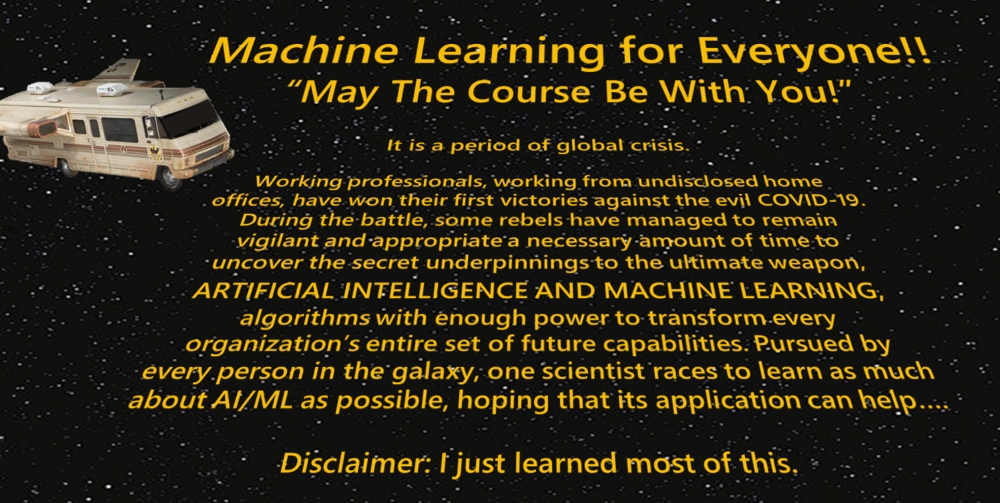
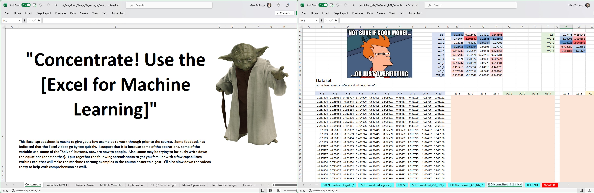

  

# Machine Learning for Everyone: May The Fourth Be With You!

Welcome to the "Machine Learning for Everyone: May The Fourth Be With You" course materials repository! In this repository, you'll find a collection of course materials designed to provide an entry point into the exciting world of machine learning, all with a Star Wars twist. Whether you're a beginner or someone looking to refresh your knowledge, this course aims to make machine learning concepts accessible and engaging.

## Introduction

Why should you spend time learning about machine learning from someone who just started down this path a few years ago? 

Great question. Thank you for asking! Well, first off, maybe because I was like you a few months back. I vividly remember the process of learning machine learning, the intuition, the concepts, and the math. It's fresh in my mind, allowing me to provide insights into what concepts are essential and how they connect.

To structure the course, I listed what I consider key machine learning concepts: regression, classification, linear regression, logistic regression, regularization, variance-bias tradeoff, loss/cost functions, activation functions, neural networks, dropout, convolutional neural networks, LSTMs, and more. I built a slide deck around these concepts, hoping for one slide per concept (which, I must admit, I miserably failed at). Nevertheless, the slide deck provides a comprehensive entry point into the world of machine learning.

And guess what? Since I am an Army scientist, I chose an Army-related dataset to work with—ballistic penetration of armor. Well, upon second thought, all datasets were transformed into Star Wars-related datasets for this course—just because. No cat classification datasets or Boston housing price datasets here. Instead, we dive into the fascinating world of bullets being stopped by armor, all with a touch of Star Wars.

I condensed seven months of online machine learning courses into a few sessions, carefully selecting the most relevant topics. I organized the course into three modules: machine learning basics, neural network basics, and neural network zoo. But wait, there's more! I added a few additional topics to cover a wider range of machine learning concepts. It's not everything, but it's a good start.

Throughout my journey, I've had the pleasure of teaching this virtual short course on machine learning to thousands of people over the last few years. The positive feedback and enthusiasm from learners have motivated me to continue sharing my knowledge and insights with the wider community.

May the fourth be with you as you embark on this machine learning adventure!

## Repository Information

This repository was created to host the course materials that I developed for the Machine Learning for Everyone virtual course that I have taught. In fact, there was a great article about this from Year 1's version [^1^], with me in a Jedi costume to boot!

## Coming Soon!

- **One Minute Machine Learning: For the 'Somewhat Familiar' with ML Crowd**: A book based on the successful course is currently in progress. Stay tuned for bite-sized insights into machine learning concepts!

## Register for the Next Course

- **Next "ML-4-Everyone: May The Fourth Be With You" Course in 2024**: Join us for the next edition of the course in 2024. Don't miss out on the opportunity to dive into machine learning with a Star Wars twist.  Wait, what? It falls on a Saturday!?!? Don't worry, we'll have this either before or after or both! 
- No other upcoming courses scheduled at the moment.

  

## Datasets

- Check out the [Datasets](./Datasets) folder to access the available datasets and examples related to the course.

## Excel for ML

- Explore the [XLS-for-ML](./XLS-for-ML) folder for resources and examples on applying machine learning concepts in Excel.
  - A Few Good Things to Know in Excel
  - Just Bullets

  

## Python for ML

- Explore the [Python-for-ML](./Python-for-ML) folder for resources and examples on applying machine learning concepts in Python.
- More to come!

## May The Course Be With You: Videos

  

### May The Fourth 2023
"Machine Learning For Everyone: May The Fourth Be With You 2023", Day One:
- [May The Fourth Be With You, 5/4/23, Kickoff Alex Kott](https://drive.google.com/file/d/1O82qn1QHX_M5SuWMgaQUsfrnEupdWuiJ/view?usp=sharing)
- [May The Fourth Be With You, 5/4/23, Machine Learning Primer](https://drive.google.com/file/d/1ywtQtE4-n6Mc2M0Vj66Y2Mw1Skb6EzBE/view?usp=sharing)
- [May The Fourth Be With You, 5/4/23, Machine Learning Basics](https://drive.google.com/file/d/1pMWRb5TkONRIrQyuxgPWUZHPow8BozFR/view?usp=sharing)
- [May The Fourth Be With You, 5/4/23, Neural Network Basics](https://drive.google.com/file/d/1vmttRrLGZ4IToOm-MSYkZ-XyU3GV1H8v/view?usp=sharing)

"Machine Learning For Everyone: Revenge of the Fifth 2023", Day Two:
- [May The Fourth Be With You, 5/5/23, Neural Network Excel Tutorial](https://drive.google.com/file/d/1qSV6bG9qonQFTHdQyeH-hVIeLfLd8-et/view?usp=sharing)
- [May The Fourth Be With You, 5/5/23, Kickoff Brian Sadler](https://drive.google.com/file/d/1Zcx0dl0qnffqOAhY4g9ROz4Yqbcvz575/view?usp=sharing)
- [May The Fourth Be With You, 5/5/23, AIML Real World Examples](https://drive.google.com/file/d/1EIONXeg-W8nDw5jXWi0TPpjXG7VieND9/view?usp=sharing)
- [May The Fourth Be With You, 5/5/23, To Encode or not to Encode](https://drive.google.com/file/d/1-nje0jFd_Utxbc_Rj0PxMK6UEARACgS6/view?usp=sharing)
- [May The Fourth Be With You, 5/5/23, Convolutional Neural Networks](https://drive.google.com/file/d/13_MvbKJxO-0H-YCUVCBBA7W6KYZZ7dN4/view?usp=sharing)
- [May The Fourth Be With You, 5/5/23, Natural Language Processing](https://drive.google.com/file/d/14JaV28xUwamP-DQ6_R7U3QgIRXWdnMAO/view?usp=sharing)
- [May The Fourth Be With You, 5/5/23, Sequence Models: RNN-GRU-LSTM](https://drive.google.com/file/d/14JaV28xUwamP-DQ6_R7U3QgIRXWdnMAO/view?usp=sharing)
- [May The Fourth Be With You, 5/5/23, Autoencoders and GANs](https://drive.google.com/file/d/14JaV28xUwamP-DQ6_R7U3QgIRXWdnMAO/view?usp=sharing)

### May The Fourth 2022
Some awesome guest speakers. The recordings span multiple lectures - a morning and afternoon recording for each day.  Expanded to two days from Year 1 (one day).
- [May The Fourth Be With You, 5/3/22, Part I](https://drive.google.com/file/d/1VVX9O6ktG8kqHOcGUcvs8VDovfHXL1LQ/view?usp=sharing)
- [May The Fourth Be With You, 5/3/22, Part II](https://drive.google.com/file/d/1EM6e5YWTYW_7sukeYMUt9koZevR3X4ly/view?usp=sharing)
- [May The Fourth Be With You, 5/4/22, Part I](https://drive.google.com/file/d/1oXLgbeGI_S065QSy0idA5YgKGo33oq0a/view?usp=sharing)
- [May The Fourth Be With You, 5/4/22, Part II](https://drive.google.com/file/d/1D7_KvcsDF9FVXypf386Q0X_Hlr_nv-ZA/view?usp=sharing)

### May The Fourth 2021
Here are the videos from Year 1, May The Fourth, in 2021. The first time, this course ran from linear regression to logistic regression to kernel-base methods to vanilla neural networks to convolutional NN and sequence models --- perhaps way too much for one day! The course has evolved quite a bit since then. Some of the kernel-based ML models were eliminated in favor of accelerating into neural networks much faster.  One thing that was different was an ML panel session with early career scientists - kudos to all of them! It was a blast!
- [May The Fourth Be With You, 5/4/21, YouTube Playlist](https://www.youtube.com/playlist?list=PLkVrqGRgZHO_hCvOhW9p7vm22GIiYVJ2w)

## Contributing

Have a really good idea about how to help? Want to work with me to see if your super-cool new machine learning algorithm could be coded up in Excel?  Have some advice on how I should structure this for github better? Let me know. Thanks!

## Credits

The "Machine Learning for Everyone" course was originally conceived by Mark Tschopp and has been developed over time based on valuable feedback from others. Thanks to everyone who has contributed along the way, supporting me in this journey.

- Mark Tschopp at [LinkedIn](https://www.linkedin.com/in/mark-tschopp/), [ORCID](https://orcid.org/0000-0001-8471-5035), [Google Scholar](https://scholar.google.com/citations?user=dg2m2WsAAAAJ&hl=en), [ResearchGate](https://www.researchgate.net/profile/Mark-Tschopp)
- Email: mark.a.tschopp.civ at arl.mil

## Course Feedback

  

I've received hundreds of course feedback comments from anonymous surveys, from emails, and from course chat. These are used to improve the course over time. Just a sample of comments from Year 1 (hundreds more like this in Years 2 and 3):
1. Quite frankly, it was the best and most entertaining presentation on this subject I have ever experienced.  Terrific job.
1. <ins>**This course was the best ML/AI I have ever taken.**</ins> I do not know anything about Star Wars but the funny captions, comments and pictures made the training even more enjoyable.
1. The content was intriguing and very eye-catchy. The instructor was excellent teacher. The concept was well-presented, very easy to understand at the surface level. Started with literally no background or training in ML, I have learned a lot more than I would ever had thought I can be. Thanks again for the great content and thanks for making me (generalized as someone who doesn't know anything about ML) understand and stay focused throughout the whole course. Thanks!
1. The course tackled an astronomical amount of information, collectively known as machine learning, with well-articulated simplicity and clarity. This one-day course seamlessly presented an overview of ML topics with stimulating visuals and graphics that would normally take hundreds of textbook pages, weeks-long online courses, and entire college semesters to cover!
1. This was so great! <ins>**If I had to give it a score, I would give it a 10 out of 9.**</ins> Thank you for putting this material out there and making it approachable for people who don't have backgrounds in linear algebra or other advanced math. The pacing of the material was great and sending out the excel spreadsheets in advance was highly conducive to helping me follow along during the lesson. […] Thanks for making something I once thought was unattainable actually seem much more accessible!
1. I loved the Star Wars theme!
1. “Excellent training! Kept me engaged. <ins>**Mark has renewed my long-forgotten love for math.**</ins> I can't wait to learn more about ML!”
1. <ins>**As a self-proclaimed Star Wars nerd, I was really looking forward to the Star Wars-themed machine learning course. I absolutely loved the way the memes/quotes/references were incorporated in a way that both held my attention throughout the course and made learning the concepts infinitely more enjoyable.**</ins> Additionally, the instructor's enthusiasm was very contagious!  As for the material itself, I really appreciated the way it was presented--especially the Excel-based examples. Often times, ‘machine learning’ is presented as something that requires tons of specialized programming knowledge which makes learning the basics a somewhat intimidating undertaking. It was refreshing to see excel being used for the smaller data sets with an explanation of how python, Matlab, etc. is needed to larger data sets. To me, that makes the content a lot more ‘relatable.’ I also really liked the ‘Jedi Council’ session at the end. It was a really clever way to put the content in ‘real-world’ context.
1. I thought it was an excellent ML short course.  The Star Wars theme added color and interest in the delivery.  […]  <ins>**THANK YOU for going out of your way to educate the workforce.  This was great.**</ins>
1. The course and the panel were both fantastic! Thank you so much for offering the course to everyone.
1. There was a lot of math for someone who never took linear algebra, but the very thoughtful and fun Star Wars theme MORE than made up for it. <ins>**As a new hire in a DoD research lab, this course should be used as a model for how to teach non-experts about your field – I would attend these all the time if they were all half this good!**</ins>
1. "Truly excellent session!  You found the perfect balance between not enough math/theory and too much.  Goldilocks level of perfection. I really enjoyed the Star Wars theme too - it made for great levity additions."
1. From the perspective of someone who is just starting to dive into the world of machine learning, I thought this course was great! Mark was knowledgeable, well-organized, and clearly enthusiastic about the material. I appreciate the use of Star Wars to help keep things fun and engaging! <ins>**I also liked that Mark chose to demonstrate neural network building in Excel rather than Python or Matlab. It was an intuitive way to visualize the process without getting bogged down by syntax and esoteric functions, even if Excel would not be the most practical way to develop neural networks for a real application.**</ins> […] Overall though, this was a great experience, and I would definitely recommend this course to others!
1. Absolutely awesome.  <ins>**The instructor is a "natural teacher", someone who is just born to teach.**</ins>  […] Truly awesome talent, presentation, pedagogy, everything.
1. The course is super! […] The presentation slides are extremely well written and organized. […] The instructor is great! A lot of us benefit from this wonderful course. Thank you!"
1. <ins>**Wow! Course was fantastic. I was pretty intimidated by the whole idea of machine learning beforehand but this primer really helped take the edge off.**</ins> I'm the kind of person who needs to be able to look under the hood of tools before I'm comfortable using them and the way Mark unpacked the equations and approaches used in the various methods was great!
1. Dr. Tschopp was an excellent instructor!!
1. This course was outstanding!
1. The various memes were of course excellent :) Thank you so much for doing this!
1. Overall, a fantastic job at this course, but I feel like it needed more star wars references (joking... maybe). I now think that Excel is probably the best/most informative way to represent these algorithms on the smaller scale. I think it improved how easily I understood the concepts.

[^1^]: Tschopp (2020). [Army hosts global AI, machine learning event](https://www.army.mil/article/246398/army_hosts_global_ai_machine_learning_event).
